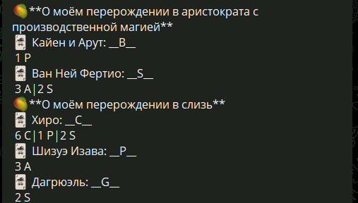

# Трекер лотов на коллекционные карты на сайте [MangaBuff](https://mangabuff.ru/)

Ваш личный телеграмм бот для отслеживания желаемых карточек [на торговой площадке](https://mangabuff.ru/market).

## Инсталляция и подготовка

### Подготовка

Для использования вам пондобятся:

1. Электронная почта зарегистрированная на MangaBuff;
2. Пароль от вашего аккаунта;
3. Токен вашего талеграмм бота;
4. ID телеграм чата с вашим ботом.

**Что если я авторизовался с помощью соцсети?**

На сайте MangaBuff есть возможность добавить элетронную почту и пароль даже если вы авторизовывались с соцсетью:

1. Авторизуйтесть;
2. Иконка вашего аккаунта в правом верхенем углу;
3. Настройки;
4. Вводите вашу электронную почту и добавляйте пароль.

**Как создать и узнать токен телеграм бота?**

Вот статья по созданию [ботов](https://t-j.ru/guide/howto-telegram-bot/?utm_referrer=https%3A%2F%2Fwww.google.com%2F#three).

**Как узнать ID чата?**

Нам необходимо для начала стартовать чат с ботом. Напищите ему хотябы один символ. Теперь:

1. Находим бота [@userinfobot](https://t.me/userinfobot).
2. Вводим команду `/start`.
3. Ваш чат ID это ID вашего аккаунта. В строчке ID под вашим username.

### Инсталляция

Теперь когда у нас все необходимые данные мы скачиваем Docker образ.

``` Bash
docker pull armandav/mangabuff-card-tracker:latest
```

> [Как установить Docker](https://selectel.ru/blog/tutorials/docker-desktop-windows/).

Создаём `.env` файл с таким форматированием.

``` .env
MANGABUFF_MAIL=Ваша почта зарегистрировання на сайте MangaBuff
MANGABUFF_PASSWORD=Пароль от аккаунта
BOT_TOKEN=Токен бота
CHAT_ID=ID чата
```

И запускаем контейнер и предаём в него наш `.env` файл.

```
docker run --env-file <путь к .env файлу> <имя образа> -p порт контейнера
```

Ну или через Docker Desktop при запуске образа задаём переменные окружения как в `.env` файле.

## Использование

Два раза в день в 11:00 и 15:00 UTC+0 Скрипт будет присылать вам карточки которые есть в данный момент на торговой площадке во вкладке ["хочу"](https://mangabuff.ru/market?want=1).


